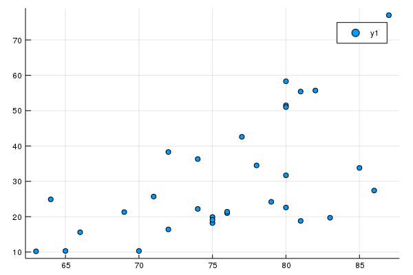
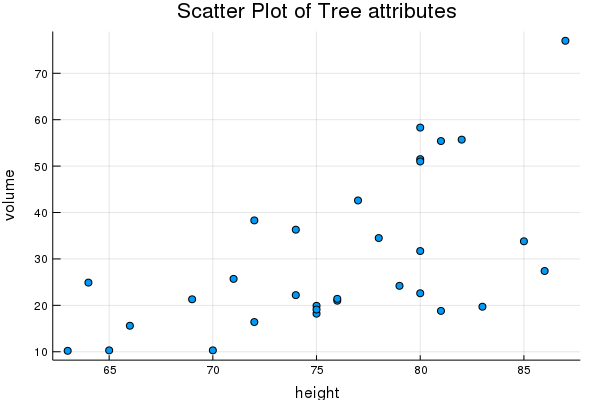
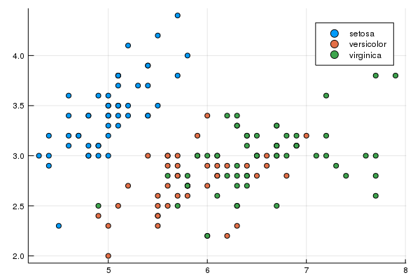
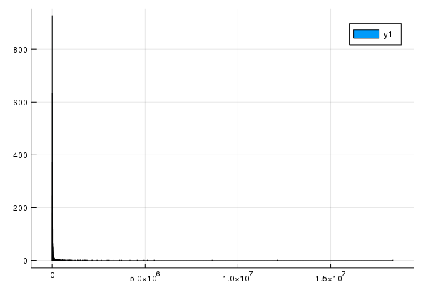
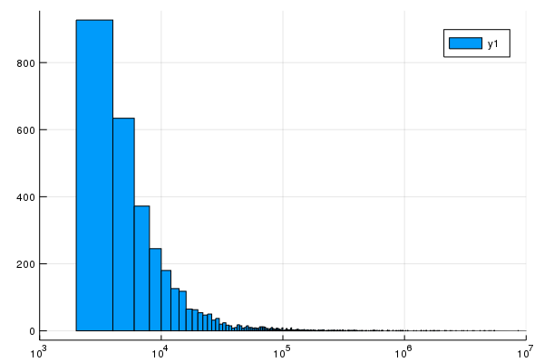
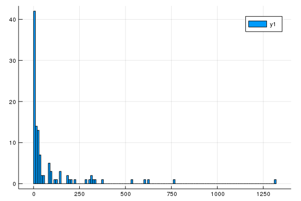
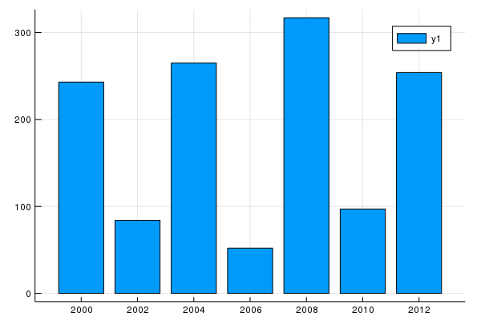

Chapter 16: Data, Data everywhere
=========

Data is ubiquitous these days and it is often crucial to analyze or plot the data.  We've seen some basic plots in julia and now we work with some other datasets.  We will mainly work with `DataArrays` and `DataFrames` in this section, which are part of the `DataFrames` package.  

### Data from other sources

In this chapter, we will be using data from a package called `RDatasets`, so it will need to be added.  To do the plotting, we also need a package called `StatPlots`

```
Pkg.add("RDatasets")
Pkg.add("StatPlots")
```

and then type
```
using RDatasets, StatPlots
```

This package contains a few hundred freely available datasets.  A list of the subpackages can be seen with
```
RDatasets.packages()
```

and then a listing of all of the datasets in each subpackage can be found with
```
RDatasets.datasets("datasets")
```

as an example.  

Finally, let's load the trees dataset from this to view:
```
trees=RDatasets.dataset("datasets","trees")
```

We can perform a scatter plot of the Height and Volume columns of this data with
```
@df trees plot(:Height,:Volume,seriestype=:scatter)
```

which will give the following plot:



#### The `Plots.jl` advantage

You may notice that we are using the `Plots` package again and we did this using the `StatPlots` package which allows us to extend all of the plotting commands to data.  

For example, we can also make a scatter plot,
```
@df trees scatter(:Height,:Volume,legend=false,title="Scatter Plot of Tree attributes",xlabel="height",ylabel="volume")
```

which is the same as a generic `plot` with the `seriestype=:scatter` option and generates the following



## Dataframes

Although it seems like arrays are a nature way to store data for data analysis, there is something called a dataframe that allows easier access.  

If you type `typeof(trees)` you'll see that julia returns `DataFrame` the internal dataframe type and you can read more about this at [the DataFrames documentation website](http://juliadata.github.io/DataFrames.jl/stable/).  One thing that dataframes allow is to have a mixture of different types, say one column of ints and one column of strings. Another good example of a data frame can be retrieved by entering.

```
iris=RDatasets.dataset("datasets","iris")
```

loads data about different species of irises.  The first 4 column are floats and the 5th column is a string but is listed as `categorical`.   Each of the columns has a name that we will be able to use more than just by column name.  

The following scatter plot delineates the species with different colors:
```
@df iris scatter(:SepalLength,:SepalWidth,group=:Species
```

and the plot is




### Details of a DataFrame

As before,
```
using DataFrames
```

A data frame is a way to store 2D data such that each column is a DataArray.  To create one, try
```
df = DataFrame(A = 1:4, B = ["M", "F", "F", "M"], C=[3.0,2.5,pi,-2.3])
```

which is printed out nicely like:
```
  A	    B	      C
  Int64	String	Float64
1	1	    M	      3.0
2	2	    F	      2.5
3	3	    F	      3.14159
4	4	    M	     -2.3

```

where you see the name of the columns, the types of each column, and then the number of each row.  There's a number of helpful functions associated with DataFrames:

* `size(df)`: similar to an array, returns the number of rows and columns.
* `names(df)`: Names of the columns as an array
* `eltypes(df)`: the types of each of the column as an array.
* `head(df)` and `tail(df)`: prints the top and bottom of the dataframe.

We can access elements in the dataframe in a manner similar to that of an array, however, the columns are usually accessed via its name:

```
df[2,:C]
```

returns 2.5. We can do subsets of the dataframe similar to that of arrays as well.  For example:
```
df[1:2:3,[:B,:C]]
```

returns the 1st and 3rd rows and only columns A and B.  

### Stats of the columns

First, we'll load in the `Statistics` package (which you may have to add):
```
using Statistics
```

Now, we can find the mean and standard deviation of columns.  For example: `mean(df[:A])` and `std(df[:C])`
which returns 2.5 and 2.604845168468006.

### The pipe command

For the following example, we start to use some of the function in the `Query` package, so you will need to load and perhaps add it.  

Julia has a command that sends the results from one function to another via what is called a pipe command.  For example, consider a array that we apply the map command.  In Chapter ??, we saw the following example:
```
map(a->a^2,[1,2,3,4,5])
```

which returns the array `[1,4,9,16,25]`.  We can get this the same way by
```
[1,2,3,4,5] |> @map(_^2)
```

and the way to think of this is to start with the array and then send the array to the map command via the pipe `|>`.  The argument in the map command uses `_` as the variable and we want to square it.  

And the nice thing about the pipe is to string together a number of functions together.  Consider
```
collect(1:10) |> @map(_^2) |> @filter(_%2==0) |> a->mean(a)
```

which is the mean of all of the even squares up to 100.  To understand this, we need to pick it apart.  

1. `collect(1:10)` creates an array from 1 to 10
2. `@map(_^2)` squares each element
3. `@filter(_%2==0)` removes all non-even numbers.
4. `arr->mean(arr)` finds the mean of the result.


We are going to use the pipe operator throughout the rest of this chapter.


###Getting data from a file

Download the file [Gaz_ua_national.csv](other/Gaz_ua_national.csv) and save it somewhere that you can access it from Julia. This file has a lot of census data that we will try to find answers.  Information about the data is [on the census website](http://www.census.gov/geo/maps-data/data/gazetteer2010.html)

###Load in the data

We are going to use the `CSVFiles` package (so add it if necessary and do `using CSVFiles`).  This includes the `load` function:

```
census_data = load("Gaz_ua_national.csv")
```

and although this looks like a DataFrame, it isn't.  Note that using `typeof(census_data)` returns `CSVFiles.CSVFile` type, which isn't as useful as a DataFrame.  So instead, let's load it in as
```
census_data = load("Gaz_ua_national.csv")
```
and checking the type shows that it is now a `DataFrame`.

### Analyzing the data

Let's say that we have the following questions that the data can answer:


1. What are the top 10 areas in population
1. How many population areas are west of 120 degrees longitude?
1. Give a histogram plot in terms of population?  (What are good bin sizes?)
2. What is the total population of all areas?
2. What the top 10 area in housing units?
2. What is the total number of housing units?
2. What is the average number of people per housing units for all areas?
2. For the top 10 area in population, find the average number of people per housing unit?
2. What are the top 10 areas in land size?
3. What are the top 10 areas in water size?
4. What are the Massachusetts areas in the data?
5. What is the average population, median and standard deviation  of the areas?


Also, in this section, it is assumed that `DataFrames, Query, Statistics` and `StatPlots` are all loaded via `using`.  Since many of the more-difficult aspects of the code below are in the `Query` package, I would recommend checking out the [documentation](http://www.queryverse.org/Query.jl/stable/).  Also most of the macros that we are using below are in the Experimental section.

###Sorting Data Frames

We can answer the first question with a simple sort, which is from the `Query` package.  
```
census_data |> @orderby_descending(_.POP10) |> DataFrame |> df->head(df,10)
```

returns the top 10 rows of the table ordered from largest to smallest.  Let's see how this is done:

1. `census_data` starts with the original DataFrame.
2. `|> @orderby_descending(_.POP10)` sorts by the column `POP10`.  The `_` is like we saw above an anonymous function and the dot notation is used like a struct, but in this case returns the column of that name.  
3. `|> DataFrame` then switches it back to a dataframe.
4. `|> df->head(df,10)` returns only the first 10 columns of the dataframe.


### Filtering the data

Let's try to find all of the location to the west of 120 degrees west longitude.  This is store in the column INTPTLONG.  We can find all of these by using the `@filter` macro.

```
census_data |> @filter(_.INTPTLONG < -120) |> DataFrame |> nrow
```

which returns 279.  

The new parts of this is the `@filter` command which returns only the rows of the dataframe in which the INTPTLONG column is smaller that -120.    Also the `nrow` command returns the number of rows in the dataframe.

### Histogram of the Population

To produce a histogram of the population, we will use the `histogram` function of `StatsPlots`.  [Check out the documentation](https://github.com/JuliaPlots/StatPlots.jl).  If we do:

```
histogram(census_data[:POP10])
```

then we get the following plot:


The trouble with this is that there are many many census areas with very little population.  We can fix this with a log scale.  If you enter
```
census_data[:POP10] |> arr->histogram(arr,xscale=:log10,xlims=(10^3,10^7
```

then the result is:


### Adding another column to the Dataframe

We are interested in finding the highest housing density, that is the number of people per housing units.  We will create a new column to do this:
```
census_data[:HOUSE_DENSITY] = census_data[:POP10]./census_data[:HU10];
```

and now sorting:
```
census_data |> @orderby_descending(_.HOUSE_DENSITY) |> DataFrame |> head
```

shows the result.


###Olympic Athletes

Let's look at another data file.  

Download the file [OlympicAthletes_0.csv](other/OlympicAthletes_0.csv), which lists all olympic medals between 2000 and 2012 and save it somewhere that you can access it from Julia. It is a comma separated file  (CSV).  Load it as a dataframe.

Here's some questions to answer:

1. What is the total number of medals given in all Olympics in the dataset?
3. Who had the most olympic gold medals in the Summer 2000 games?  How many medals?
2. Collectively taking each olympics, give the top 10 athletes by number of medals.
4. Who has the most Olympic Silver medals in the data set (Collectively over multiple olympics)
5. Produce a new DataFrame that lists total number of medals by country.  Produce a histogram of the total number of medals.
6. Plot the number of medals that the U.S. collected over each olympic year.  
7. What is the age with the most number of total medals.  
8. Produce a new data set with total number of medals per sport per year.  What are the top five sports over the past 4 olympics.  

#### Loading the file

Since it it comma delimited, the following will load the file:
```
oly = load("../code/datasets/OlympicAthletes_0.csv") |> DataFrame;
```

and view the first few rows with
```
head(oly)
```

It's helpful to have column names without spaces in them, so we will replace all of the spaces with underscores.  

First, we create a Dictionary (we will see these later) from the old to new names:
```
newnames = collect(zip(names(oly),map(s->Symbol(replace(string(s)," "=>"_")),names(oly))))
```

and then rename the columns of the DataFrame:
```
rename!(oly,newnames)
```


#### 1. What is the total number of medals given in all Olympics in the dataset?

This will be the sum of the `Total_Medals` column:

```
sum(oly[:Total_Medals])
```

which returns 9529

#### 2. Who had the most olympic gold medals in the Summer 2000 games?  How many medals?

In this case, we will get a subset of the DataFrame and sort by Total Medals or
```
oly |> @filter(_.Year == 2000) |> @orderby_descending(_.Total_Medals) |> DataFrame |> head
```

and this shows that Aleksey Nemov of Russia had the most with 6 medals.

#### 3. Collectively taking each olympics, give the top 10 athletes by number of medals.

We need to do a bit of work for this one.  Since over all olympics for each athlete we need to add up all of the medals.  This is known as grouping a dataset and the `Query` package does this.   Before we answer the question about the athletes, consider a simpler example:
```
df = DataFrame(name=["Fred","Fred","Fred","Jose","Jose","Caroline"],car=["Camry","Rav4","Corolla","Odyssey","Rio","Prius"])
```

lists 3 people and the cars they own.  We want to summarize the data as the total number of cars each person has.  If we

```
df |> @groupby(_.name)
```

and although a bit hard to read, it is now a list of the 3 people and collectively the cars they own:
```
df |> @groupby(_.name) |> @map({Name=_.name,Num_cars=length(_.car)}) |> DataFrame
```


First, we group the data by Athlete's name (in the Athlete column)  To see what happens with this, do
```
oly |>
  @groupby(_.Athlete) |>
  @map({Athlete = unique(_.Athlete)[1], total = sum(_.Total_Medals)}) |>
  @orderby_descending(_.total) |>
  DataFrame
```


#### 4. Who has the most Olympic Silver medals in the data set (Collectively over multiple olympics)

This is very similar to that above except that the Silver Medals are examined instead.   I will leave it up to you to figure this out.

#### 5. Produce a new DataFrame that lists total number of medals by country.  Produce a histogram of the total number of medals.

This is similar to the total numbers by athletes:

```
medals = oly |>
  @groupby(_.Country) |>
  @map({Country=unique(_.Country)[1],Total_Medals=sum(_.Total_Medals)})  |>
  @orderby_descending(_.Total_Medals) |>
  DataFrame;
```

which does the following

  1. groups the dataset by country.
  2. summarizes the data into a new dataframe which is country and total medals
  3. sorts them in decreasing order.

and the following (which uses `StatPlots`):
```
@df medals histogram(:Total_Medals,bins=120)
```

which results in




#### 6. Plot the number of medals that the U.S. collected over each olympic year.

In this case, we need to just get a subset of the U.S. medals:

```
us_medals_by_year = oly |>
  @filter(_.Country == "United States") |>
  @groupby(_.Year) |>
  @map({Year = unique(_.Year)[1], Total_Medals = sum(_.Total_Medals)})  |>
  @orderby(_.Year) |> DataFrame
```

and the following gives a decent plot:

```
@df us_medals_by_year bar(:Year,:Total_Medals)
```




#### 7. What is the age with the most number of total medals?

In this case, we group by age and sum total medals:

```
medals_by_age = oly |>
  @groupby(_.Age) |>
  @map({Age = unique(_.Age)[1], Total_Medals = sum(_.Total_Medals)}) |>
  @orderby_descending(_.Total_Medals)
```

show that age 24 has the most medals.  

#### 8. Produce a new data set with total number of medals per sport per year.  What are the top five sports in medals for 2002, 2012?  

First, we'll consider the 2002 year:
```
oly |>
  @filter(_.Year == 2002) |>
  @groupby(_.Sport) |>
  @map({Year = _.Year[1], Sport=_.Sport[1],Total_Medals=sum(_.Total_Medals)}) |>
  @orderby_descending(_.Total_Medals)
```

results in Ice Hockey, Cross Country Skiing, Short-Track Speed Skating, Biathlon and Alpine Skiing.

And in 2012:

```
oly |>
  @filter(_.Year == 2012) |>
  @groupby(_.Sport) |>
  @map({Year = _.Year[1], Sport=_.Sport[1],Total_Medals=sum(_.Total_Medals)}) |>
  @orderby_descending(_.Total_Medals)
```

This shows the top 5 are Swimming, Athletics (Track and Field), Rowing, Football (Soccer) and Hockey (probably field hockey).  
