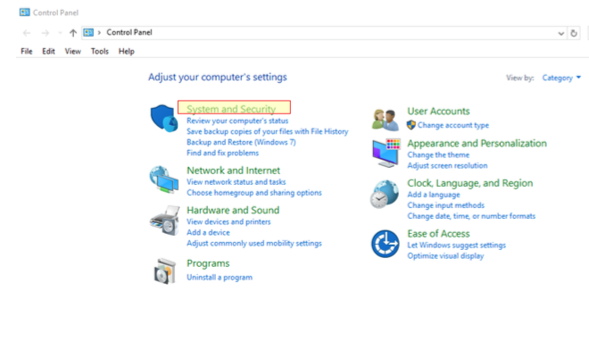
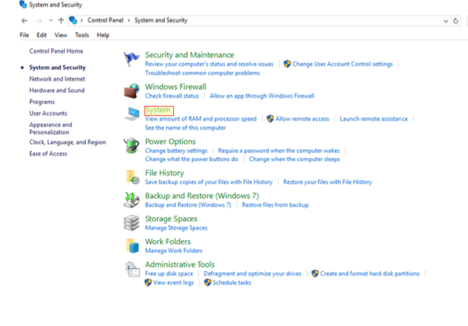
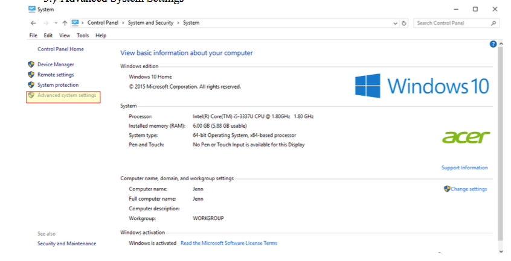
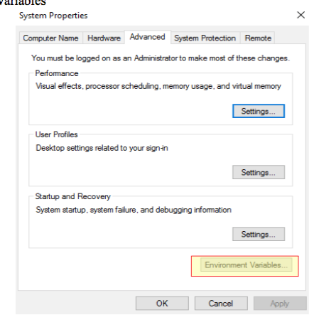
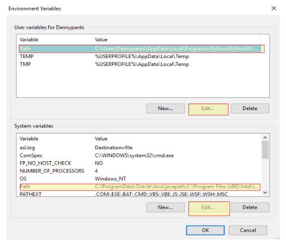
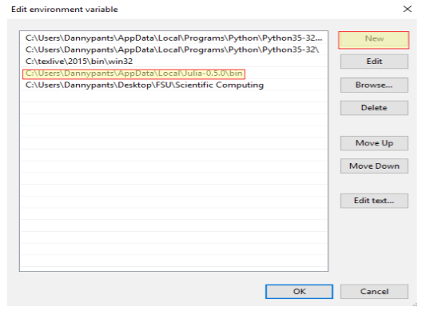

Running Julia code
======

[Return to all notes](index.html)


This describes a number of ways to get [Julia](https://julialang.org) up and running.  A recommendation is to start with running Julia from JuliaBox.com (described below) and then getting Julia running on a personal computer.  As you progress within this page, some things are a little more difficult to install and troubleshoot.  I hope to include more information here during the semester to get things up and running more smoothly.

### Using Julia on the Cloud


1. Go to [JuliaBox.com](https://juliabox.com/)
2. Possibly your FSU account may work as sign-in via Google since your email is run by Google.  If not you may need an account.  After getting signed in, it should look like:


3. After signing in, you can select *New* -> *Julia-0.6.2* (or hopefully *Julia-1.0*)  as a new document.  The result should look like this:

4. To test everything is working, type `2+3` in the box that is highlighted in blue and hit SHIFT-ENTER. You should get the result 5.

### Installing Julia on your personal machine


There are precompiled versions for Mac, Windows and Linux at [the Julia Download page](http://julialang.org/downloads/).  Currently, there is version 1.0 available.

Once you download Julia, there should be an app that you can open up as a console (command line).  This is the basic julia installation.


Installing the Browser Version on your machine
-----

If you used JuliaBox like we saw above, that is a browser version of Julia and has a lot of nice features.  To get this, it is called IJulia.  Follow the directions at the [IJulia github site](https://github.com/JuliaLang/IJulia.jl) for information on getting it installed.  


Using Jupyter (via JuliaBox or your local machine)
------

The browser interface to julia, called Jupyter allows some nice features.  It&#8217;s advantageous to read through the Help pull-down menu in Jupyter, but here's a few big things:

* There are four modes to an input box, but only two that I will cover here: 1) `code` mode.  This allows for entering Julia code and is the default option.  2) Markdown mode.  This allows you to add formatted comments using markdown (google it).  For example, typing `### Header` produces a nice heading.

* The *kernel* menu has ways to restart the kernel and run all of the

* Click on the name of the file in the upper right corner of the document to change its name.

* To save the file, goto *File* then *Download* and use the format of your choice.


Setting up a link to the command line version
-----

As we will see in the course, accessing the command line version of Julia is helpful.  It is a little different for doing this on the Mac/Linux and on Windows.

#### Setting up julia in your path on Mac/Linux

1. Open up the `Terminal`.  This is located in the `Applications` directory or search for `Terminal` in Spotlight.

2. Navigate to the julia binary on your computer.  You can do
    ```
    cd /Applications/Julia-0.7.app/Contents/Resources/julia
    ```

    or similar (but this may not quite work) OR find the Julia app in the Finder, CTRL-click on the Julia app and select `Show Package Contents`, then navigate as shown:

    

3. Select the `bin` directory and return to the `Terminal` and type `cd ` (put a space) then paste. Type `ls` and you should see:
    ```
    julia		julia-debug
    ```

4.  Now, type
    ```
    echo -e "\n\nexport "PATH=$PATH:$(pwd) >> ~/.bash_profile
    ```

    then
    ```
    source ~/.bash_profile
    ```

    If you type `julia`, you should see julia starting up.  Great.  

    If it worked type `exit()`.


#### Setting up julia in your path on Windows

Thanks to Dan Hanmore for figuring these out:

1. Open Control Panel, go to System and Security

    

2. System

    

3. Advanced System Settings

    

4. Environment Variables

    

5. Click Edit with either the user path or the system path highlighted, I just did user path and it worked fine.

    

6. Do not click New on the above screen, as naming a variable Path will replace the old path completely. If you do this, you can still Cancel out of the screen above and then reenter it. Click New on the screen below, and either enter your path manually or browse to it. Yours should look like the highlighted one, with your user account name.

    


Getting Atom
-------

Atom is a nice text editor that allows you to do julia within it.  


Download, install and open [Atom](https://atom.io). If you have it already, make sure it's up to date (version 1.99+).

In Atom, go to Settings (<kbd>Ctrl ,</kbd>, or <kbd>Cmd ,</kbd> on OS X) and go to the "Install" panel.

Type `uber-juno` into the search box and hit enter. Click the install button on the package of the same name.

Atom will then set up Juno for you, installing the required Atom and Julia packages. Once the setup is done you're good to go!

This doesn't always work smoothly.  Read the errors if there are any.  Typically, if you go to a terminal window, and type `Pkg.update()` or `Pkg.build()`, this will fix the errors.

## Notes (taken from the [Juno lab site](https://github.com/JunoLab/uber-juno/blob/master/setup.md))

If you have any issues with this setup, please do report it here or at [Juno Discuss](http://discuss.junolab.org). We'll do our best to help you get going.

The development version of Julia (v0.5) isn't officially supported via these instructions. If you know what you're doing you can get it working by following [these instructions](https://github.com/JunoLab/atom-julia-client/tree/master/docs).

[Let us know](http://discuss.junolab.org) if you have any other issues or questions.
