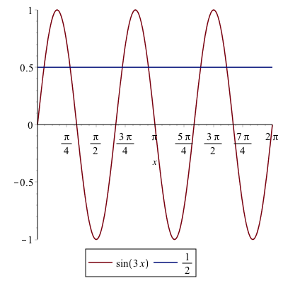
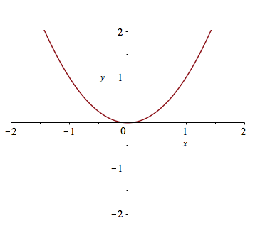
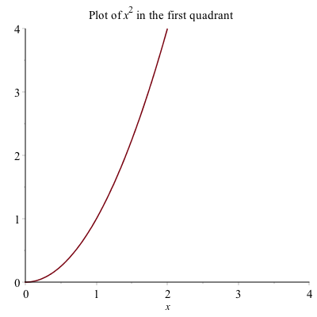
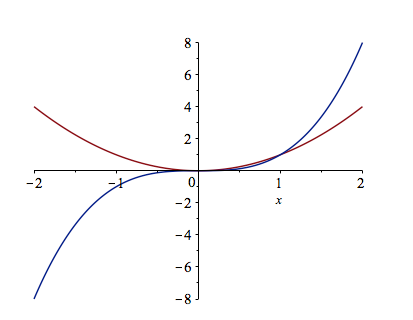
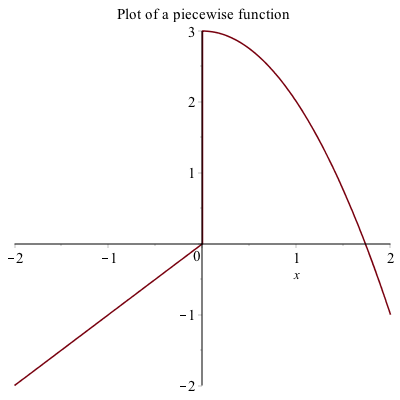
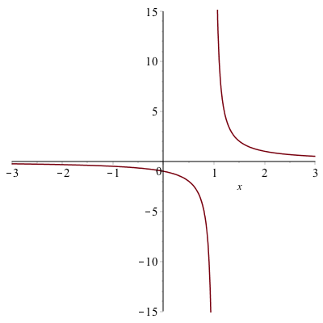
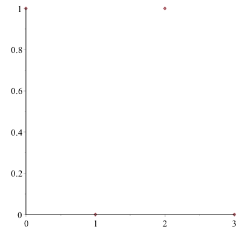
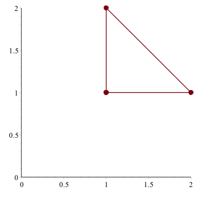
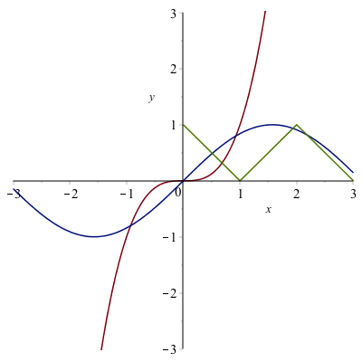
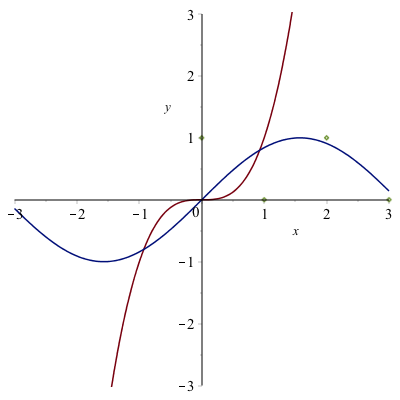

Chapter 2: Precalculus Topics
=======

Solving Equations
---

You probably recall from throughout your mathematical career that solving an equation can be difficult.[^solve]  Maple can often solve equations effortlessly. For example if we type
```
solve(x^2-3x-4=0)
```
Maple returns `4,-1`, meaning that both 4 and -1 are solutions to the equation.  

[^solve]: Solving equations are difficult for many reasons.  One is that they require you to categorize the equation to determine the type (linear, quadratic, exponential, etc) and they to know (or be creative) to go through steps that result in the solution (or solutions).  Another reason solving is difficult is that many equations do no have an solution that results from performing algebraic steps.


###Exercise

1. Open the help page for `solve`.
2. What happens if you don't have an equation?      Try solving a linear expression like $2x+4$.
3. Solve the equation $x^{2}+4xy+2y^{2}=9$ for $x$, then for $y$.


Solving Trigonometric Equations
------

You should have seen how to solve trigonometric equations (an equation containing trigonometric functions) in Precalculus.  In general these are quite difficult to solve, however Maple can handle many kinds of Trigonometric equations.  Try solving $$\sin 3x = \frac{1}{2}.$$

Maple returns $$\frac{1}{18}\pi$$
which is indeed a solution to the equation.  However, it isn't the only solution.  Recall that the solution(s) of an equation is(are) the point(s) of intersection of the graphs of the functions on either side of the equation.  If we  type:
```
plot([sin(3x),1/2],x=-2pi..2pi)
```

(using $\pi$ instead of `pi`) then we get a plot the functions $f(x)=\sin 3x$ and $g(x)=1/2$ on the interval $0\leq x\leq 2\pi$ you'll get the following plot:



On the interval that we plotted, there are 6 intersection points, but if we changed the plotting interval, that would change.  There are actually an infinite number of intersection points.

Notice that the solution $\pi/18$ that Maple returned is the smallest intersection point in the plot above.  We also have the ability to find all of them.

###Finding solutions to equations on an interval

First, let's find the solutions to $\sin 3x=1/2$ that we see on the interval $0 \leq x \leq 2\pi$.  The following command will do this
```
Student[Calculus1][Roots](sin(3x)=1/2,x=0..2pi)
```
and you will see 6 roots.  

Now you might (and probably should) be thinking, that's a crazy command to get the solutions.  What's with the brackets?  We will explain this in the next chapter.  In short, it is a way to call a command that is in a library that is not built-in to Maple by default.  We will see a shortcut to call this later.  

###Finding all solutions to a trigonometric equation

And you're asking yourself, "How can I can find all of the solutions?"  Try putting $x=-\infty..\infty$ in for the interval.  What happened?

Okay, that didn't work.  Here's a way to solve $\sin x=0$, which should have the solution that any integer multiple of $\pi$.  If we type:
```
solve(sin(x)=0,x,allsolutions = true)
```
We get $\pi\\_ Z1$~  (or another number after the Z).  This is a bit strange, but this is Maple's way of saying any integer multiple of $\pi$.  

### Exercise

1. Find all the solutions for $\tan 2x=1$.  Write a sentence explaining the result.
2. Find all the solutions for $\sin 3x =1/2$.  Write a sentence explaining the result.

Exact versus approximate solutions
------

Using `solve`, Maple will try to find an exact solution to an equation.  Generally, this is what you want.  However, try solving
$$x^{3}+3x^{2}-11x-10=0$$
and you will see a mess (no really, try it).

###Exercise
1. What kind of function is it?
2. How many roots can you get?
3. Plot the function on a window so you see all of the roots (zeros).
4. What is an estimate of the roots (zeros)?

Maple can automatically find the approximate solutions to an equation using the `fsolve` function.  Try

```
fsolve(x^3+3x^2-11x-10=0)
```
and you should see 3 roots:
```
-4.844519677, -.7850044458, 2.629524123
```

Solving Inequalities
----

Another important mathematical technique that a CAS is generally good at is solving inequalities, like $4x+3>5x-7$.  The command in Maple is identical to that of solving equations.  
```
solve(4x+3>5x-7,x)
```
will return *RealRange(-$\infty$,Open(10))*.  This is Maple's notation for $(-\infty,10)$.  Try changing the greater than sign in the inequality to a greater than or equal to, which you type in `>=` and Maple will change it automatically to a $\geq$.  

Maple will solve many types of inequalities.  Another example is `solve(x^2-9>=0,x)` which returns *RealRange(-$\infty$,-3),RealRange(3,$\infty$)*.  In standard interval notation, this is $(-\infty,-3] \bigcup [3,\infty)$.  


Plotting
-----

Most CAS systems will produce very nice plots and Maple is among these.   The standard plot will be that of a function, but we will see that plotting multiple functions and points is also possible.  Maple is very flexible in creating plots.

###Plotting Functions

In order to plot the expression $x^{2}$, try typing `plot(x^2)`. You should see a plot similar to


###Changing the Plotting Window of a plot

Typically, the easiest way to change the plotting window of the plot is to use an option in the plot command. For example, if we want a plot on the domain $\\{x \;|\; -2 \leq x \leq 2\\}$, then typing `plot(x^2,x=-2..2)` will produce the plot:


If you want to make sure that the axes include other y values, you can also specify those values. For example, try typing `plot(x^2,x=-2..2,y=-2..2)`.




If you’d like a title on your plot, you can add the title option. For example, try `plot(x^2,x=-2..2,title="A plot of the square function")` and you will see


If you try to put the $x^{2}$ function in the title, you will run into problems. This is due to a typesetting issue. You can add the $x^2$ function by typing

```
plot(x^2,x=-2..2,title=typeset("A plot of ", x^2))
```
You have called a command called `typeset` that will help Maple understand how to print out what you want. If you search plot in the **Help Browser**, then scroll down to `plot,typesetting`, you will find more information and examples to typeset.

###Exercise

Plot $f(x) = \sin x$ on the range $[−6.25, 6.25]$. Give the plot a title that includes the function.


###Alternative Way to Change the plotting window of a plot

Another way to change the plotting window of a plot is to use the `view` option.  If I just want to see the plot of $x^{2}$ in the first quadrant, you can type
```
plot(x^2, x = -2 .. 2, view = [0 .. 4, 0 .. 4], title = typeset("Plot of %1 in the first quadrant", x^2))
```

to get:



The view option sets the horizontal and vertical range respectively.  


###Plotting multiple functions
Often, we would like to include more that one function on a single set of axes. Maple allows us to do this easily. Plot $x^{2}$ as we did above. To add the plot of $x^{3}$, enter it as an expression. Then drag the expression until is highlighted in blue. Click and hold the mouse on the expression, until a + appears, then drag and drop onto the other axes. You will see a second plot appear.

This is a bit complicated and doesn't always work (or save well).  A better way to do this is to use plot command by typing `plot([x^2,x^3 ],x=-2..2)` which results in



###Adding a Legend

A legend is important for any plot containing more than one function. This allows you to distinguish between the curves. There is a legend option to the plot function. For example, to add a legend and a title to the plot of $x^2$ and $x^3$ type:

```
plot([x^2, x^3], x = -2..2,legend = [x^2, x^3], title = typeset("A plot of %1 and %2.", x^2, x^3))
```
and you will see:


###Alternative Way to Add a Legend
Alternatively, to add a legend, right-click on the plot, select Legend, then Show Legend, and the legend pops up with the line color of the first curve only. To change the legend on the curve, double click the text next to it.

If there is more than one curve and you want to add that to the legend, select the curve, then right-click select Legend, then Add Lengend and you should see that added to the Legend. Double-click the new legend and change the label. You can do this again with more curves.

I recommend the first way to add a legend because when opening a document and rerunning it (which will be discussed below), Maple tends to not mess up the plot when it is all typed out.  

###Exercise
Graph the functions $\sin x, \sin 2x,$ and $2 \sin x$ on the same coordinate axis. Label your graphs using the legend, and change your plot range to $−2\pi \leq x \leq 2\pi$ and $−2.5 \leq y \leq 2.5$.

Changing the Aspect Ratio of a Plot
-------

Often it is important to have an aspect ratio of 1:1 for a plot.  For example, consider a plot of $\sqrt{4-x^2}$, which is the top half of a circle.  If it is plotted on $-3 \leq x \leq 3$, then the curve looks like an ellipse, not a circle.  

If you click on the plot, the toolbar changes to the following:


And if the 1:1 button is selected, the plot will be forced to have the right aspect ratio.

###Exercise

Plot the functions $f(x)=2x+3$ and $g(x)=-\frac{1}{2}x+1$ and make the plot ratio 1:1. The two lines should be perpendicular.  (Why?)


Plotting a function with a parameter
--------

Piecewise Functions
--------

Another common plot is that of a piecewise function, consider
$$f(x) = \begin{cases} x & x<0 \newline 3-x^{2} & x \geq 0 \end{cases}$$

The way to enter this in is the following:
```
f:=piecewise(x<0,x,3-x^2,x>=0)
```
where the interval comes before the function.  Notice that Maple formats it like we typically write it out mathematically.

Then we can plot it like other functions:
```
plot(f,x=-2..2,title="Plot of a piecewise function")
```

results in the following plot:


Plotting Functions with discontinuities
------

If you plot the function $\frac{1}{x-1}$ using the command `plot(1/(x-1),x=-3..3)`
the plot will look like:


The vertical line at $x = 1$ is not part of the graph. The line is only because Maple is just connecting a number of generated points with lines. Maple also has a way to detect the discontinuities using the discont=true option. For example, the above is found with
```
plot(1/(x-1),x=-3..3,discont=true)
```
the plot will look like:



and as you can see the line of $x=1$ is not part of the plot.  This is a proper plot and anytime that you plot a function with a discontinuity, you should use the `discont=true` option.


Plotting Points
----

Plot a set of discrete points as follows:

1. Enter[^lists]:`dots:=[[0,1],[1,0],[2,1],[3,0]]`
2. Enter: `plot(dots,style=point)`

[^lists]: This is a list and will be explained in Chapter 3.

and you should see the following plot:



The points will be plotted as what is called a scatter plot. In order to connect the dots, add the style=line option to the end of the command.

####Exercise

1. Type `?plot,style` to see other plotting styles.
2. Create a plot that looks like:



(Hint: look at the `plot,options` help page for a list of all options and look at the `symbol` and `symbolsize`)

Combining Scatter and Function Plots
-----
We can combine a scatter and function plot in nearly the same way as above. This is best show with an example:
Type out the following:

```
dots:= [[0, 1], [1, 0], [2, 1], [3, 0]]
plot([x^3, sin(x), dots],x=-3..3,y=-3..3)
```

This will produce a plot that looks like:



Overall, this looks good, however, the points are not draw as points, but as a sequence of lines. We can fix this by adding a style option, so change the plot command to

```
plot([x^3, sin(x), dots],x=-3..3,y=-3..3,style=[line,line,point])
```
where the first two are line plots (the default) and the last is a point plot.  The resulting plot is



You can then add a legend as shown above.


Substituting values into expressions
----

Often, if we have an expression, it's nice to substitute values into this.  There is a command called `subs`  (short for substitute) that will do this.  For example, if we use Maple to solve the equation $x^{2}-5x+4=0$, we will get $1,4$ as an answer (that is both $x=1$ and $x=4$ are solutions).  How do we show this? One ways to to evaluate $1^{2}-5(1)+4$ and $4^{2}-5(4)+4$ and show each is zero, however a better way is to use a variable to write the left side or
```
f:=x^2-5x+4
```

Then if we type `subs(x=1,f)` and `subs(x=4,f)`, then these subsitutes $x=1$ and $x=4$ into the expression in `f`.  Both will be zero.

We can substitute anything into anything else.  Try the following:
1. `subs(x=20,f)`
2. `subs(x=t,f)`
3. `subs(x+h,f)`
4. `(subs(x+h,f)-f)/h`

where the last one is the difference quotient related to the derivative.

Functions
-----

A function in Maple behaves much like a mathematical function, which has a number as an input (or multiple numbers) and returns a number.  You can also think of it as a rule from an $x$ value to a $y$.  For example if we have the square function, the standard way to write it in Maple is
```
f(x):=x^2
```

Note that except for the : (colon), this looks like a definition of a function that we would write mathematically.  Also, if you are using a Maple version prior to Maple 2016, you will get a dialog box that asks to explain what the input is.  Hit "function definition".

The return from above is:
$$ x \rightarrow x^{2} $$

which is the way that Maple stores functions.  In short this says that the left side is the variable $x$ and the output is $x^{2}$.  

The great thing about functions is that they act much like mathematical functions.  If you have defined the function $f$ as above, now we can do things to functions including

* evaluating functions at points.
* evaluating functions at other expressions like $x+h$.
* function composition
* differentiating.  

### Exercise

Try the following:

* $f(2), f(-2), f(10)$.
* $f(y), f(x+1)$
* $$\frac{f(x+h)-f(x)}{h}$$
* $f'(2)$
* $f'(x)$
* Define $g(x)=\dfrac{x}{x+1}$ and find $g(f(x))$ and $f(g(x))$.


Expressions versus Functions
-----

Now that we see both expressions and functions, what's the difference?  When should I use one versus the other?  

In short, if you think of an expression as a function itself, probably use function notation.  Especially if you need to take a derivative.  Also, as we will see, if you want a number of values substituted into an expression quickly, a function should be used.  Otherwise, either is often fine and I often don't know when I start solving a problem the best thing to use.  

Finding the domain of a function
-----

Maple can be helpful for finding the domain of functions, however, we need to recall some basics of functions.  Recall that the domain of $\sqrt{x}$ is $[0,\infty)$, or the inside must be greater than or equal to zero.  We can then use Maple to help find say the domain of $\sqrt{x^2-5x+4}$, by solving
```
solve(x^2-5x+4>=0)
```
to get (in interval notation), $(-\infty,1]\bigcup[4,\infty)$, so this is the domain of $\sqrt{x^2-5x+4}$.

###Exercise

Find the domain of each of the following
1. $\dfrac{1}{x^{2}-16}$
2. $\ln(5x+7)$
3. $\sin(3x^{3}+5)$

(Hint: you will need to recall the domains of each of the outside functions)

Odd and Even functions
-----

Recall that an **odd** function satisfies $f(-x)=-f(x)$ for all $x$ on its domain and an **even** function satisfies $f(-x)=f(x)$ for all $x$ on its domain.  Here's a nice way to show these are satisfied in Maple.

Show $f(x)=x^{3}$ is an odd function.  It seems logical to show in Maple `f(-x)=-f(x)`.  In this simple case, both sides are the same, so it seems it is an odd function.  Let's look at a more complex function,
$$f(x)=\frac{4x^{3}+2x}{x^{2}+5}$$
and in Maple, we do `f(-x)=-f(x)`, then Maple returns
$$\frac{-4x^{3}-2x}{x^{2}+5}=-\frac{4x^{3}+2x}{x^{2}+5}$$
which takes a bit of work to recall that these are equal.  To make it clearer, we will rewrite $f(-x)=-f(x)$ by adding $f(x)$ to both sides to get $f(-x)+f(x)=0$.   If we type `f(-x)+f(x)` into Maple, we get:
$$\frac{-4x^{3}-2x}{x^{2}+5}+\frac{4x^{3}+2x}{x^{2}+5}$$
which again, isn't so clear, but if we simplify by typing `simplify(f(-x)+f(x))`, we get 0. This shows it is odd.  


###Exercise

1.  Show that $g(x)={\rm e}^{x^{2}}$ is an even function.
2. Is $h(x)=\sqrt{3x+4}$ even, odd or neither.  


Numerators and Denominators
----

Recall that a rational function is a a polynomial over another polynomial.  Examples include
$$\frac{1}{x}, \frac{x^{3}-3x}{x^{2}+1}, \frac{15x^{5}+3x^{2}}{4x^{2}+2}$$

And recall that we need to examine the individual numerator and denomiator to find $x$-intercepts and vertical asymptotes.  To get these, we can use the `numer` and `denom` commands.  

For example, if
$$g(x) = \frac{4x^{3}-16x}{x^{2}-9}.$$
then

1. Find the domain of $g$
2. find the $x$-intercepts of $g$
2. Find the vertical asymptotes.  

Since, we can't divide by 0, we need to know where the  denominator is 0 or
```
solve(denom(g(x)))
```
resultng in $-3$, and $3$.  Therefore, the domain is $(-\infty,-3)\bigcup(-3,3)\bigcup(3,\infty)$.

For the answer to 2, we need to find the zeros (roots) of the top and
```
solve(numer(g(x)))
```
will return 0,-2,2.  And the answer to the 3, is the zeros of the denominator or
```
solve(denom(g(x))
```
which returns -3,3.  Recall that this means the asymptotes, which are lines, are $x=3$ and $x=-3$.  

Partial Fractions
-------

The technique of partial fractions come up in many areas in mathematics including the integration of rational functions and finding inverse Laplace Transforms (in differential equations).  An example is if we have the following rational function:
$$R(x)=\frac{2x-2}{x^{2}+4x+3}$$
and if we wish to write it as the sum of two simpler forms:
$$\frac{4}{x+3}-\frac{2}{x+1}$$

The technique of going from a general rational function to a sum of simpler rational functions is called *partial fractions*.  To do this, we recognize that if we factor the denomiator of $R$ or $(x+3)(x+1)$ so we hope to write:
$$\frac{2x-2}{x^{2}+4x+3} =\frac{A}{x+3}+\frac{B}{x+1}$$
or finding $A$ and $B$.  Multiplying through by the denominator of $R$ results in
$$2x-2 = A(x+1)+B(x+3)$$
or
$$2x-2=Ax+Bx+A+3B$$

at this point we *equate coefficients*  by finding the coefficients of the $x$ term and the constant term on either side of the equation. This results in two equations:
$$\begin{array}{rl}2&=A+B\newline -2&=A+3B\end{array}$$

subtracting these, results in $4=-2B$ or $B=-2$ and then you can find $A=4$.  This shows that

$$\frac{2x-2}{x^{2}+4x+3}=\frac{4}{x+3}-\frac{2}{x+1}$$

###Using Maple to help us find partial fractions

We start again with
```
R:=(2x-2)/(x^2+4x+3)
```

and we factor the denominator:

```
factor(denom(R))
```

returns $(x+3)(x+1)$, so we write the equation:
$$\frac{2x-2}{x^{2}+4x+3}=\frac{A}{x+3}+\frac{B}{x+1}$$
and then we multiply through by the denominator of $R$.
```
simplify((#)*denom(R))
```

where (#) is the equation above.  This returns:
$$2x-2 = Ax+Bx+A+3B$$

To get the equations representing the coefficients:
```
coeff(lhs((#)), x) = coeff(rhs((#)), x)
```

will return $2=A+B$, the coefficients of the $x$ terms on both sides.  To get the constant terms:
```
coeff(lhs((#)), x,0) = coeff(rhs((#)), x,0)
```

will return $-2=A+3B$.

Lastly, we can just solve this to get: $\{A = 4, B = -2\}$ so the result is:

$$\frac{2x-2}{x^{2}+4x+3}=\frac{4}{x+3}-\frac{2}{x+1}$$

###Converting an expanded form back.  

How do you reverse the partial fraction?  If you are doing it by hand, it is simply finding a common denominator and combining terms.  In Maple,
```
normal(4/(x+3)-2/(x+1),expanded)
```

returns $$\frac{2x-2}{x^{2}+4x+3}.$$


###Exercise

Find the partial fraction form of
$$\frac{9x^{2}+8x-4}{x^{3}-4x}$$
using the steps above. Check your answer by reversing the partial fraction form.  


###Using the built-in method

Of course, Maple can do all of these steps at once.  If we use the $R$ from above, typing
```
convert(R,parfrac)
```

returns $$\frac{4}{x+3}-\frac{2}{x+1}.$$


###Exercise

1. Use `convert` to check your result above.  
2. Find the partial fraction form of $${\frac {4\,{x}^{6}+15\,{x}^{5}+34\,{x}^{4}+66\,{x}^{3}+94\,{x}^{2}+56\,x+40}{{x}^{4}+2\,{x}^{3}+5\,{x}^{2}+8\,x+4}}$$

Long Division of Polynomials
-------

Another common technique needed to do is long division of polynomials.  

For example, from [Purple Math's long division page](http://www.purplemath.com/modules/polydiv2.htm), if we want to do $(x^{2}-9x-10)\div (x+1)$, the result is $x-10$.  

Maple will do this using `simplify`.  That is, if
$$R=\frac{x^{2}-9x-10}{x+1}$$
and then performing
```
simplify(R)
```

returns $x-10$.  However, (from [another PM page](http://www.purplemath.com/modules/polydiv3.htm) consider if
$$Q=\frac{3x^{3}-5x^{2}+10x-3}{3x+1}$$
then `simplify(Q)` returns $Q$ again.  But we may want to actually do the long division.  

The command `quo` and `rem` find the quotient and remainder using polynomial long division.  If $Q$ is defined as the rational function above, then
```
quo(numer(Q),denom(Q),x)
```

returns $x^{2}-2x+4$, the quotient and
```
rem(numer(Q),denom(Q),x)
```

returns $-7$.  This means that we can write:
$$Q=\frac{3x^{3}-5x^{2}+10x-3}{3x+1}= x^{2}-2x+4+ \frac{-7}{3x+1}$$

and to determine that this worked, typing
```
normal(x^2-2x+4-7/(3x+1))
```

returns the improper form of $Q$ as above.  
