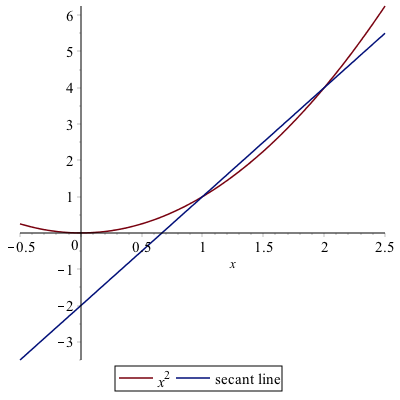

Differential Calculus Problems in Maple
========

This chapter covers how to perform many mathematics that arises from Calculus using a CAS like Maple.  As we will see, a CAS will often do limits and derivatives quite easily, allowing us to investigate the geometry of the deriviatve using a plot or a table of values, which are often helpful for gaining intution about limits and derivatives. 

Limits
-----

You may need to review the basics of a limit from Calculus.  If we say
$$L = \lim_{x \rightarrow 2} x^2$$ 
then $L$ is the value of the function $x^2$ as $x$ approaches 1 (from either side), but not at exactly 1.  We can examine this using a plot of the function:


And from the plot it appears that the limit is 1, however, you can never say precisely with a plot, but this can help verify a result.  

Another way to attack this is with a table.  Let's find the value of the function $f(x)=x^2$, at the points $x=0.9,0.99,0.999,1.001,1.01,1.1$.  We can do this easily with the `map` function.  If

```
f:=x->x^2
xvals := [.9, .99, .999, 1.001, 1.01, 1.1]
map(f,xvals)
```
will produce the function values of all of the $x$ values given or
```
[.81, .9801, .998001, 1.002001, 1.0201, 1.21]
```

It would be really nice to have a table formatted nicer.  If instead we typed
```
map(x->[x,f(x)],xvals)
```
then we get the following:
```
[[.9, .81], [.99, .9801], [.999, .998001], [1.001, 1.002001], [1.01, 1.0201], [1.1, 1.21]]
```
which still doesn't look nice, but if we wrap the function in `Matrix` as in:
```
Matrix(map(x->[x,f(x)],xvals))
```
it will look like: $$\left[ \begin {array}{cc}  0.9& 0.81\newline 
0.99&0.9801\newline
0.999& 0.998001\newline
 1.001& 1.002001\newline
 1.01& 1.0201\newline
 1.1& 1.21\end {array} \right] 
$$

and then the only other addition might be to label the columns, which can be done in the following way.  If we redo `xvals` to include a term $x$ at the front or:
```
xvals := [x,.9, .99, .999, 1.001, 1.01, 1.1]
```
then rerunning: 
```
Matrix(map(x->[x,f(x)],xvals))
```
will result in the matrix $$\left[\begin{array}{cc} x &  x^{2}\newline
0.9 & 0.81 \newline
0.99&0.9801\newline
0.999& 0.998001\newline
 1.001& 1.002001\newline
 1.01& 1.0201\newline
 1.1& 1.21
\end{array}\right]$$

As you can now see from the table above, as $x$ gets closer to 1, $x^2$ gets closer to 1.  You're thinking, duh, $1^{2}=1$, which is true, but we often use a limit when you can't just evaluate a function at the point $a$.  

###Exercise
Reproduce the table above using $$f(x)= \frac{x^{2}-4}{x-2}$$ 
when $a=2$.  Use an appropriate set of points that are both less than and greater than 2.  Guess a value of the limit.  


###Using Maple's built-in Limit function. 


Now, of course, Maple (and any CAS) will do the limit for us.  If you type out `limit`, hit the ESC key, select the first item, you will see:
$$\lim_{x\rightarrow a} f$$
and you can fill in $a$ and $f$ (and change $x$ if it's a different variable).  So doing this for the limit above results in:
$$\lim_{x \rightarrow 1}x^{2}$$
and maple will return 1.  

###Exercise
Try evaluating the following limits:
1. $$\lim_{x \rightarrow 2} \frac{x^{2}-4}{x-2}$$
2. $$\lim_{t \rightarrow 0} \frac{\sin t}{t}$$
3. $$\lim_{x \rightarrow 1} \frac{\ln x}{x-1}$$

Secant and Tangent Lines
------

Recall that a secant line through a function is the line that passes through the function at two points.  For example, consider the secant line through the function $f(x)=x^2$ that passes through the function when $x=1$ and $x=2$.  A plot of this is:



and you can see from the plot that indeed the line passes through the given points.  Also, recall to find the slope of the secant line, we'll need to evaluate the function at the $x$ values.  
```
f:=x->x^2
m:=(f(2)-f(1))/(2-1)
```
which is 3 in this case.  We can then use the point-slope form of the line with either the point $(1,1)$ or $(2,4)$.  


Derivatives
------

Applications of Derivatives
-------

