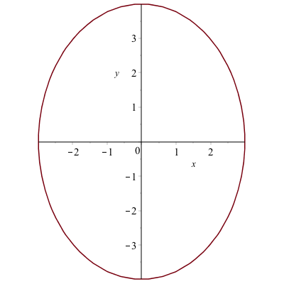
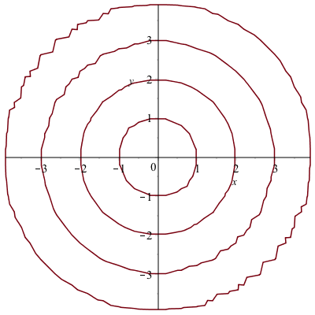
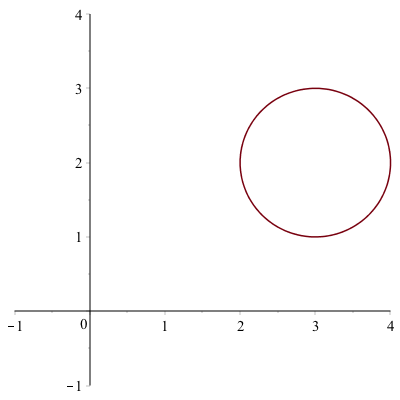
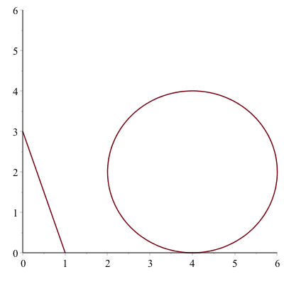
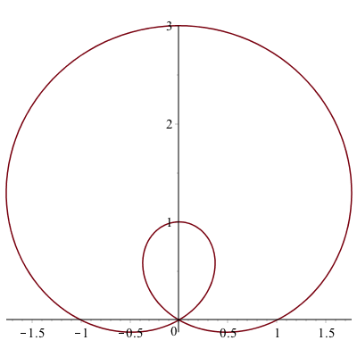

Plotting in Maple
======

We have already seen that Maple has some great plotting capabilities.  In this chapter, we will see a number of other plots that Maple (and most CAS programs) can handle. 

The plots library
------

Except for the function plots, the plots that we will see here are in the plots library which are loaded with the command:
```
with(plots):
```

Take a look at the help page (overview) of this library to see what is in it. 

Function Plots
------

We have seen a function plot in other places.  Look in previous chapter for more information on these.

(Note: add info here)


Implicit Plots
------

If a you have a function of $x$ and $y$ and would like to visualizes the set of points that satisfy the curve, then `implicitplot` is what you want to use.  


###Implicit Plot of one equation

```
implicitplot(x^2+y^2=25,x=-5..5,y=-5..5)
```

will give the following plot:


If we try the following:
```
implicitplot((1/9)*x^2+(1/16)*y^2=1, x=-5..5, y=-5..5)
```
then it also looks like a circle, like the plot:


but the curve is actually an ellipse, but doesn't look like one.  Make sure that you have the 1:1 button hit and it will look like:



###Implicit curves don't always look right

If we plot the following:
$$circles:=(x^2+y^2-1)(x^2+y^2-4)(x^2+y^2-9)(x^2+y^2-16) = 0$$

We get the plot:



and you will see that there are jagged edges.  This plot should be a set of 4 concentric circles.  The reason that Maple produces the curve like this is that when making the plot, it uses a grid of points to try to determine if a point in on a curve.  By default, it uses relative few points for the grid and if this case, we will want more. 

The `implicitplot` command has an option `gridrefine` that will help smooth out this curve. 

We can plot the circles above by 

```
implicitplot(circles,x=-5..5,y=-5..5,gridrefine=2)
```

You will get the plot:


(Note: start with gridrefine=1 or 2 and if you need a smoother curve, increase slowly)


###Finding the derivative of an implicit curve

Recall that we can use the `implicitdiff` command to find the derivative of an implicit curve at a point.  For example, let's say that we wish to find the tangent line to the circle above at the point $(3,4)$.  

If we define the circle to be
```
circle:=x^2+y^2=25
```
then we can find the derivative by typing
```
implicitdiff(circle,y,x)
```
and Maple returns $$-\frac{x}{y}$$. and we can then use the `subs` command to evaluate this at a point. 
```
subs([x=3,y=4],(#))
```
where (#) is the line number of the derivative.  The result should be $-3/4$ and then you can find the tangent line using the point slope form:
```
tanLine:=y=-3/4*(x-3)+4
```

where the tangent line is put in as an equation.  

###Implicit Plot of more than one equation

To plot these two on the same axes, use [] like in a standard function plot.  The plot of the circle and the tangent line can be found with

```
implicitplot([circle,tanLine],x=-1..2,y=-1..2,color=[red,blue])
```


###Exercise 

1. Plot the cardiod given by $x^2+y^2 = (2x^2+2y^2-x)^2$
2. Find the tangent line to the curve at $P(0,-1/2)$.  


Parametric Plots
------


A parametric graph or parametric curve is one in which the $x$ and $y$ coordinates depend on another variable, often $t$.  In general, we write
$$x=f(t) \qquad y=g(t)$$

A nice example is
$$x=t^2 \qquad y=t^3-t$$

For a given set of values of $t$, the $x$ and $y$ values can be found by plugging in
$$\begin{array}{ccc}
t & x & y &  \newline \hline
-1.5 & 2.25 & -4.875 \newline
-1 & 1 & 0 \newline
-1/2 & 1/4 & -3/8 \newline
0 & 0 & 0 \newline
1/2 & 1/4 & 3/8 \newline
1 & 1 & 0 \newline
1.5 & 2.25 & 4.875
\end{array}$$

We can plot this in Maple using the standard `plot` command:
```
plot([t^2,t^3-t,t=-2..2])
```
where it is important to note the difference in syntax.  The range for $t$ needs to be there and *inside* the brackets.  The plot should look like:


###Another example

The parametric curve given by 
$$x=\cos t \qquad y=\sin t$$
for $0\leq t \leq 2\pi$ is another way to write a circle with center at the origin and radius of 1. 

This is because if we plug these functions into the equation $x^2+y^2=1$, then 
$$
(\cos t)^2+(\sin t)^2=1
$$
which is true for all $t$ because $\cos^2 t + \sin^2 t =1$.  

We can shift any curve horizontally and vertically in the following way, which we'll show using an example.  If we shift the circle above right 3 and up 2, we'll get the circle with center $(3,2)$.  This curve can be written:
$$x=3+\cos t \qquad y=2+\sin t$$
and plotting with a window that includes the origin is:


And we can make this an ellipse by multiplying the $\cos t$ and $\sin t$ terms by constants.  For example, 
$$x=3+1.5\cos t \qquad y=2+0.8\sin t$$


###Let's make a line segment

Any curve written in terms of $y(x)$ can be written parametrically in the following way.  Let $x=t$, then let $y=y(t)$.  For example, consider the line $y=2x+1$.  This can be written:
$$x=t\qquad y=2t+1$$
If we want to plot it from $x=-1$ to $x=1$, then $t$ will satisfy: $-1 \leq t \leq 1$  and the following command:
```
plot([t,2t+1,t=-1..1])
```
will generate the following plot:


###Parametric piecewise functions

Mixing parametric functions and piecewise functions gives tons of flexibility.  Let's plot both a circle and a line segment using the same function.  First, let's find the line segment connecting the points $(0,3)$ and $(1,0)$. The slope of this is $-3$, so the function is $y=-3(x-0)+3$.  Parametrically, we can write this
$$x=t \qquad y=-3t+3$$

We will notice later that it will be helpful to use $t$ values bigger than $2\pi$, so an alternative is to use
$$x=t-10 \qquad y=-3(t-10)+3$$

If we also want a circle of radius 2, centered at (4,2), we can write that as
$$x=4+2\cos t \qquad y=2+2\sin t$$

Then we produce the following piecewise function by defining:
```
x:=piecewise(0<=t<=2*pi,4+2*cos(t),10<=t<=11,t-10)
y:=piecewise(0<=t<=2*pi,2+2*sin(t),10<=t<=11,-3*(t-10)+3)
```
then if we plot this piecewise:
```
plot([x,y,t=0..11],discont=true,view=[0..6,0..6])
```
will give the plot:


and make sure that you put `discont=true` option so the line segment is not connected to the circle.  


###Tangent line to a parametric curve

Here we reproduce the tangent line to the circle of radius 5 at the point $(3,4)$.  


The parametric curve given by 
$$x=5\cos t \qquad y=5\sin t$$
for $0\leq t \leq 2\pi$ is another way to write a circle with center at the origin and radius of 5. 

To plot this in Maple, we use the `plot` command with a different syntax. 
```
plot([5*cos(t),5*sin(t),t=0..2pi])
```
will produce the following circle. 


which is the same plot as the implicit one above.  


To make some things easier, let&#8217;s define
```
x:=t->5*cos(t)
y:=t->5*sin(t)
```

We can also find the tangent line to a parametric curve in the following way.  The derivative $\frac{dy}{dx}$ to a curve can be written:
$$
\frac{dy}{dx} = \frac{\frac{dy}{dt}}{\frac{dx}{dy}}
$$

To find the deriavative to the circle above at the point $(3,4)$, we need to find the $t$ value at the point.  We can do this by solving for $t$ by setting $x=3$ and $t=4$.  (It's recommended to use the `Roots` command on the interval `0..`$\pi/2$ because the point is in the first quadrant.)

```
Roots(x(t)=3, t = 0 .. (1/2)*Pi)
```
returns  $[\arccos(3/5)]$
and
```
Roots(y(t)=4, t = 0 .. (1/2)*Pi)
```
returns  $[\arcsin(4/5)]$.  They seem to given different answer, but they are equivalent. 

If we substitute either of these into the derivative above:
```
subs(t=arccos(3/5),y'(t)/x'(t))
```
and then simplify it.  The result is $-3/4$, the same answer as above using implicit differentiation.  


The tangent line then is the curve
```
tanLine:=-3/4(x-3)+4
```

again, the same as above and can be written parametrically as
$$
x=t \qquad y=-\frac{3}{4}(x-3)+4$$

and the following will put the circle and the line on the same axes:
```
plot([[t, -3/4*(t-3)+4, t = -2 .. 8], [5*cos(t), 5*sin(t), t = 0 .. 2*Pi]], view = [-5 .. 8, -5 .. 8])
```


Polar Plots
------

It is often that one will use polar coordinates to perform a plot.  We will see a few examples where this is helpful.  If a function is written in polar coordinates, then it is written in the form $r=f(\theta)$. 

This is a specific form of a parametric curve with the form:
$$x=r \cos \theta \qquad y=r\sin \theta$$

For example, the cardiod that you plotted above can be written:
$$r=1+\cos(\theta)$$
and we can plot it using the `polarplot` command
```
polarplot(1+cos(theta), theta = 0 .. 2*Pi)
```
(and note that you can get theta to look like the greek letter, by hitting ESC after typing `theta`)

The plot will look like:


And altenatively, if you don't want the polar axes shown, you can use the regular plot command with the `coord=polar` option:
```
plot(1+cos(theta),theta=0..2*Pi,coord=polar)
```
which will generate the plot:


###A tangent line to a polar plot.  

The curve $r=1+2\sin \theta$ passes through the origin.  We will find the tangent line to the curve at the point. 


First, a plot of the curve is




Multiple plot types and the `display` command
------

We have seen above that if we want to plot more that one curve on the same axes. 

If we want to plot the parametric curve
$$x=3\cos 2t \quad y=2\sin 3t$, 
with the implicit curve given by
$$(x^2+y^2)^2-2*(x^2-y^2) = 1$$

then 

Common Options
------

* `view` which changes the viewing window.  Note: you should change the plotting domain as well with this. 
* `legend` which adds a legend. 
* `color` which changes the color.


Scatter Plots
------

animated plots
------

Three Dimensional Plots
------