Chapter 6: Plotting in Maple
======

We have already seen that Maple has some great plotting capabilities.  In this chapter, we will see a number of other plots that Maple (and most CAS programs) can produce.

The plots library
------

Except for the function plots, the plots that we will see here are in the plots library which are loaded with the command:
```
with(plots):
```

Take a look at the help page (overview) of this library to see what is in it.
```
?plots
```
will open the overview in the Help Browser.  From there you can see all of the possible types of plots in Maple.  We will cover just a few of these.  

Function Plots
------

We have seen a function plot in other places and this is a repeat of a lot of that material.  

In order to plot the expression $x^{2}$, try typing `plot(x^2)`. You should see a plot similar to


###Changing the Plotting Window of a plot

Typically, the easiest way to change the plotting window of the plot is to use an option in the plot command. For example, if we want a plot on the domain $\{x \;|\; -2 \leq x \leq 2\}$, then typing `plot(x^2,x=-2..2)` will produce the plot:

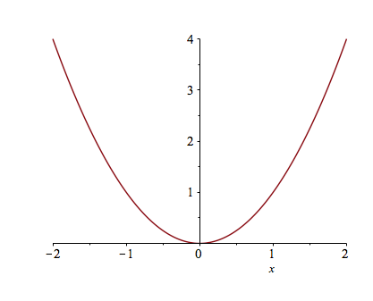

If you want to make sure that the axes include other y values, you can also specify those values. For example, try typing `plot(x^2,x=-2..2,y=-2..2)`.


If you’d like a title on your plot, you can add the title option. For example, try `plot(x^2,x=-2..2,title="A plot of the square function")` and you will see

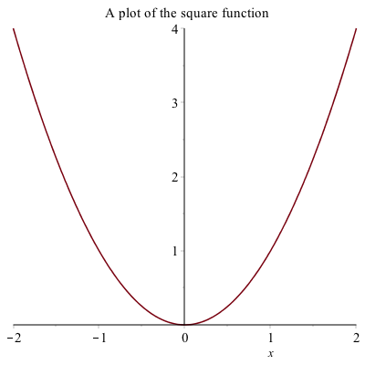

If you try to put the $x^{2}$ function in the title, you will run into problems. This is due to a typesetting issue. You can add the $x^{2}$ function by typing

```
plot(x^2,x=-2..2,title=typeset("A plot of ", x^2))
```
You have called a command called `typeset` that will help Maple understand how to print out what you want. If you search plot in the **Help Browser**, then scroll down to `plot,typesetting`, you will find more information and examples to typeset.


###Alternative Way to Change the plotting window of a plot

Another way to change the plotting window of a plot is to use the `view` option.  If I just want to see the plot of $x^{2}$ in the first quadrant, you can type
```
plot(x^2, x=-2..2, view=[0..4,0..4],title=typeset("Plot of %1 in the first quadrant", x^2))
```

to get:


The view option sets the horizontal and vertical range respectively.  


###Plotting multiple functions
Often, we would like to include more that one function on a single set of axes. Maple allows us to do this easily. Plot $x^{2}$ as we did above. To add the plot of $x^3$, enter it as an expression. Then drag the expression until is highlighted in blue. Click and hold the mouse on the expression, until a + appears, then drag and drop onto the other axes. You will see a second plot appear.

This is a bit complicated and doesn't always work (or save well).  A better way to do this is to use plot command by typing `plot([x^2 ,x^3 ],x=-2..2)` which results in


####Adding a Legend

A legend is important for any plot containing more than one function. This allows you to distinguish between the curves. There is a legend option to the plot function. For example, to add a legend and a title to the plot of $x^{2}$ and $x^3$ type:

```
plot([x^2, x^3], x = -2..2,legend = [x^2, x^3], title = typeset("A plot of %1 and %2.", x^2, x^3))
```
and you will see:
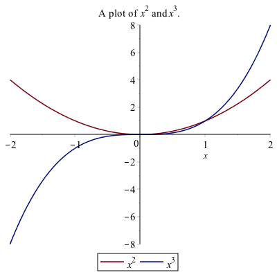

###Alternative Way to Add a Legend
Alternatively, to add a legend, right-click on the plot, select Legend, then Show Legend, and the legend pops up with the line color of the first curve only. To change the legend on the curve, double click the text next to it.

If there is more than one curve and you want to add that to the legend, select the curve, then right-click select Legend, then Add Lengend and you should see that added to the Legend. Double-click the new legend and change the label. You can do this again with more curves.

I recommend the first way to add a legend because when opening a document and rerunning it (which will be discussed below), Maple tends to not mess up the plot when it is all typed out.  


###Changing the Aspect Ratio of a Plot


Often it is important to have an aspect ratio of 1:1 for a plot.  For example, consider a plot of $\sqrt{4-x^{2}}$, which is the top half of a circle.  If it is plotted on $-3 \leq x \leq 3$, then the curve looks like an ellipse, not a circle.  

If you click on the plot, the toolbar changes to the following:


And if the 1:1 button is selected, the plot will be forced to have the right aspect ratio.


###Piecewise Functions


Another common plot is that of a piecewise function, consider
$$f(x) = \begin{cases} x & x<0 \\ 3-x^{2} & x \geq 0 \end{cases}$$

The way to enter this in is the following:
```
f:=piecewise(x<0,x,3-x^2,x>=0)
```
where the interval comes before the function.  Notice that Maple formats it like we typically write it out mathematically.

Then we can plot it like other functions:
```
plot(f,x=-2..2,title="Plot of a piecewise function")
```

results in the following plot:


###Plotting Functions with discontinuities


If you plot the function $\frac{1}{x-1}$ using the command `plot(1/(x-1),x=-3..3)`
the plot will look like:

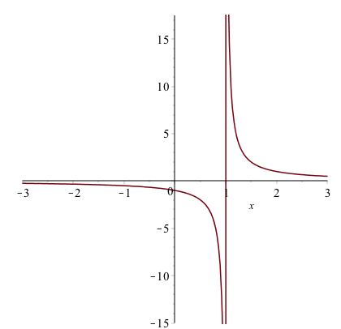

The vertical line at $x = 1$ is not part of the graph. The line is only because Maple is just connecting a number of generated points with lines. Maple also has a way to detect the discontinuities using the discont=true option. For example, the above is found with
```
plot(1/(x-1),x=-3..3,discont=true)
```
the plot will look like:


and as you can see the line of $x=1$ is not part of the plot.  This is a proper plot and anytime that you plot a function with a discontinuity, you should use the `discont=true` option.


Implicit Plots
------

If a you have a function of $x$ and $y$ and would like to visualize the set of points that satisfy the curve, then `implicitplot` is what you want to use.  


###Implicit Plot of one equation

```
implicitplot(x^2+y^2=25,x=-5..5,y=-5..5)
```

will give the following plot:


If we try the following:
```
implicitplot((1/9)*x^2+(1/16)*y^2=1, x=-5..5, y=-5..5)
```
then it also looks like a circle, like the plot:

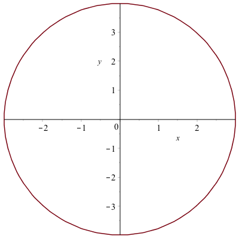

but the curve is actually an ellipse, but doesn't look like one.  Make sure that you have the 1:1 button hit and it will look like:


###Implicit curves don't always look right

The following equation
$$circles:=(x^{2}+y^{2}-1)(x^{2}+y^{2}-4)(x^{2}+y^{2}-9)(x^{2}+y^{2}-16) = 0$$
is a set of 4 concentric circles because the four terms that are multiplied are each a circle.  If any one of them is satisfied, then the equation is zero.  (Note: this is a supercool way of putting more than one equation on a plot.)

However, if we plot the equation, we get the plot:


and you will see that there are jagged edges.  The reason that Maple produces the curve like this is that when making the plot, it uses a grid of points to try to determine if a point in on a curve.  By default, it uses relative few points for the grid and if this case, we will want more.

The `implicitplot` command has an option `gridrefine` that will help smooth out this curve.

We can plot the circles above by

```
implicitplot(circles,x=-5..5,y=-5..5,gridrefine=2)
```

You will get the plot:

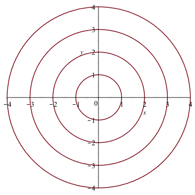


(Note: start with gridrefine=1 or 2 and if you need a smoother curve, increase this parameter slowly.  A gridrefine of 5 or more can take a long time.)


###Finding the derivative of an implicit curve

Recall that we can use the `implicitdiff` command to find the derivative of an implicit curve at a point.  For example, let's say that we wish to find the tangent line to the circle above at the point $(3,4)$.  

If we define the circle to be
```
circle:=x^2+y^2=25
```
then we can find the derivative by typing
```
implicitdiff(circle,y,x)
```
and Maple returns $$-\frac{x}{y}$$ and we can then use the `subs` command to evaluate this at a point.
```
subs([x=3,y=4],(#))
```
where (#) is the line number of the derivative.  The result should be $-3/4$ and then you can find the tangent line using the point slope form:
```
tanLine:=y=-3/4*(x-3)+4
```

where the tangent line is put in as an equation.  

###Implicit Plot of more than one equation

To plot these two on the same axes, use [] like in a standard function plot.  The plot of the circle and the tangent line can be found with

```
implicitplot([circle,tanLine],x=-1..2,y=-1..2,color=[red,blue],legend=["circle","tangent line"],title="A plot of a circle and its tangent line.")
```


###Exercise

1. Plot the cardiod given by $x^{2}+y^{2} = (2x^{2}+2y^{2}-x)^{2}$
2. Find the tangent line to the curve at $P(0,-1/2)$.  


Parametric Plots
------


A parametric graph or parametric curve is one in which the $x$ and $y$ coordinates depend on another variable, often $t$.  In general, we write
$$x=f(t) \qquad y=g(t)$$

A nice example is
$$x=t^{2} \qquad y=t^{3}-t$$

For a given set of values of $t$, the $x$ and $y$ values can be found by plugging in
$$\begin{array}{ccc}
t & x & y &  \newline \hline
-1.5 & 2.25 & -4.875 \newline
-1 & 1 & 0 \newline
-1/2 & 1/4 & -3/8 \newline
0 & 0 & 0 \newline
1/2 & 1/4 & 3/8 \newline
1 & 1 & 0 \newline
1.5 & 2.25 & 4.875
\end{array}$$

We can plot this in Maple using the standard `plot` command:
```
plot([t^2,t^3-t,t=-2..2])
```
where it is important to note the difference in syntax.  The range for $t$ needs to be there and *inside* the brackets.  The plot should look like:

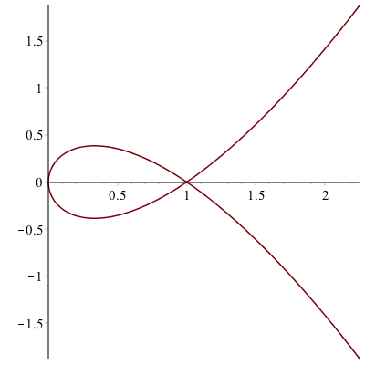

###Another example

The parametric curve given by
$$x=\cos t \qquad y=\sin t$$
for $0\leq t \leq 2\pi$ is another way to write a circle with center at the origin and radius of 1.

This is because if we plug these functions into the equation $x^{2}+y^{2}=1$, then
$$
(\cos t)^{2}+(\sin t)^{2}=1
$$
which is true for all $t$ because $\cos^{2} t + \sin^{2} t =1$.  

We can shift any curve horizontally and vertically in the following way, which we'll show using an example.  If we shift the circle above right 3 and up 2, we'll get the circle with center $(3,2)$.  This curve can be written:
$$x=3+\cos t \qquad y=2+\sin t$$
and plotting with a window that includes the origin is:


And we can make this an ellipse by multiplying the $\cos t$ and $\sin t$ terms by constants.  For example,
$$x=3+1.5\cos t \qquad y=2+0.8\sin t$$

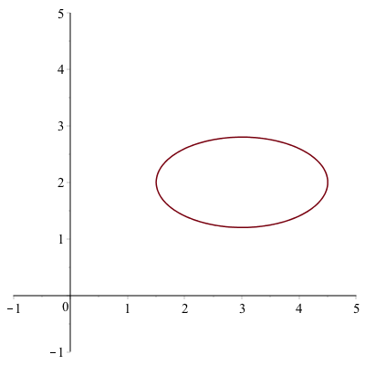

###Let's make a line segment

Any curve written in terms of $y(x)$ can be written parametrically in the following way.  Let $x=t$, then let $y=y(t)$.  For example, consider the line $y=2x+1$.  This can be written:
$$x=t\qquad y=2t+1$$
If we want to plot it from $x=-1$ to $x=1$, then $t$ will satisfy: $-1 \leq t \leq 1$  and the following command:
```
plot([t,2t+1,t=-1..1])
```
will generate the following plot:
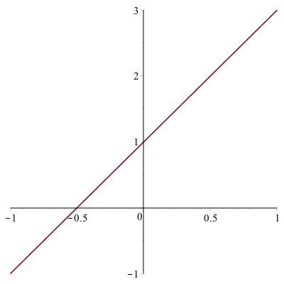

###Parametric piecewise functions

Mixing parametric functions and piecewise functions gives tons of flexibility.  Let's plot both a circle and a line segment using the same function.  First, let's find the line segment connecting the points $(0,3)$ and $(1,0)$. The slope of this is $-3$, so the function is $y=-3(x-0)+3$.  Parametrically, we can write this
$$x=t \qquad y=-3t+3$$

We will notice later that it will be helpful to use $t$ values bigger than $2\pi$, so an alternative is to use
$$x=t-10 \qquad y=-3(t-10)+3$$

If we also want a circle of radius 2, centered at (4,2), we can write that as
$$x=4+2\cos t \qquad y=2+2\sin t$$

Then we produce the following piecewise function by defining:
```
x:=piecewise(0<=t<=2*pi,4+2*cos(t),10<=t<=11,t-10)
y:=piecewise(0<=t<=2*pi,2+2*sin(t),10<=t<=11,-3*(t-10)+3)
```
then if we plot this piecewise:
```
plot([x,y,t=0..11],discont=true,view=[0..6,0..6])
```
will give the plot:


and make sure that you put `discont=true` option so the line segment is not connected to the circle.  


###Tangent line to a parametric curve

Here we reproduce the tangent line to the circle of radius 5 at the point $(3,4)$.  


The parametric curve given by
$$x=5\cos t \qquad y=5\sin t$$
for $0\leq t \leq 2\pi$ is another way to write a circle with center at the origin and radius of 5.

To plot this in Maple, we use the `plot` command with a different syntax.
```
plot([5*cos(t),5*sin(t),t=0..2pi])
```
will produce the following circle.


which is the same plot as the implicit one above.  


To make some things easier, let&#8217;s define
```
x:=t->5*cos(t)
y:=t->5*sin(t)
```

We can also find the tangent line to a parametric curve in the following way.  The derivative $\frac{dy}{dx}$ to a curve can be written:
$$
\frac{dy}{dx} = \frac{\frac{dy}{dt}}{\frac{dx}{dt}}
$$

To find the deriavative to the circle above at the point $(3,4)$, we need to find the $t$ value at the point.  We can do this by solving for $t$ by setting $x=3$ and $t=4$.  (It's recommended to use the `Roots` command on the interval `0..`$\pi/2$ because the point is in the first quadrant.)

```
Roots(x(t)=3, t = 0 .. (1/2)*Pi)
```
returns  $[\arccos(3/5)]$
and
```
Roots(y(t)=4, t = 0 .. (1/2)*Pi)
```
returns  $[\arcsin(4/5)]$.  They seem to given different answer, but they are equivalent.

If we substitute either of these into the derivative above:
```
subs(t=arccos(3/5),y'(t)/x'(t))
```
and then simplify it.  The result is $-3/4$, the same answer as above using implicit differentiation.  


The tangent line then is the curve
```
tanLine:=-3/4(x-3)+4
```

again, the same as above and can be written parametrically as
$$
x=t \qquad y=-\frac{3}{4}(x-3)+4$$

and the following will put the circle and the line on the same axes:
```
plot([[t, -3/4*(t-3)+4, t=-2..8], [5*cos(t), 5*sin(t), t=0..2*Pi]], view = [-5..8,-5..8])
```

with give the following plot (which is identical to others above):

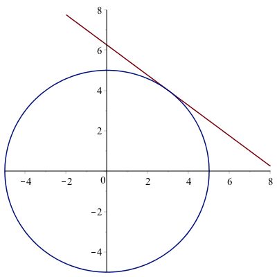


Polar Plots
------

It is often that one will use polar coordinates to perform a plot.  We will see a few examples where this is helpful.  If a function is written in polar coordinates, then it is written in the form $r=f(\theta)$.

This is a specific form of a parametric curve with the form:
$$x=r \cos \theta \qquad y=r\sin \theta$$

For example, the cardiod that you plotted above can be written:
$$r=1+\cos(\theta)$$
and we can plot it using the `polarplot` command
```
polarplot(1+cos(theta), theta = 0 .. 2*Pi)
```
(and note that you can get theta to look like the greek letter, by hitting ESC after typing `theta`)

The plot will look like:
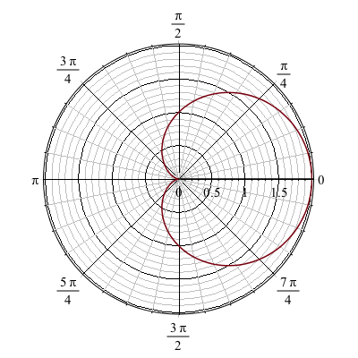

And altenatively, if you don't want the polar axes shown, you can use the regular plot command with the `coord=polar` option:
```
plot(1+cos(theta),theta=0..2*Pi,coords=polar)
```
which will generate the plot:
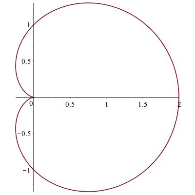

###A tangent line to a polar plot.  

The curve $r=1+2\sin \theta$ passes through the origin.  We will find the tangent line to the curve at the point.


First, a plot of the curve is


We now seek the tangent line to the curve at the point $P(1,0)$.  It's helpful to define the $x$ and $y$ coorinates parametrically using $x=r \cos \theta$ and $y=r \sin \theta$ for $r=1+2\sin \theta$:
```
x := theta->(1+2*sin(theta))*cos(theta)
y := theta->(1+2*sin(theta))*sin(theta)
```

And then to find the value of $\theta$ at the point $P(1,0)$, we set $x=1$ and $y=0$.
```
Roots(x(theta)=1,theta=0..Pi/2)
```
(where we use 0..Pi/2 because the point $P(1,0)$ is in the first quadrant), results in
$$[0,\arctan \left( 1/3\,{\frac { \left( 28+3\,\sqrt {87} \right) ^{2/3}
+4\,\sqrt [3]{28+3\,\sqrt {87}}+1}{\sqrt [3]{28+3\,\sqrt {87}}}}
 \right) ]
$$
(and recall these are values for $\theta$.)  The first one is what we want because that is the horizontal axis.  The second value the the point $(1,2.5)$.   If we find $y=0$ using
```
Roots(y(theta)=0,theta=0..Pi/2)
```
then we get  `[0]`,  which is consistent with above.  The slope of the tangent line here is
```
y'(0)/x'(0)
```
or $\frac{1}{2}$.  Then using the point-slope formula for the tangent line, we get:
```
y=\frac{1}{2}(x-1)+0
```

To plot both, we'll use the parametric form (an alternative way will be presented below):
```
plot([x(theta),y(theta),theta=0..2*Pi],[t,1/2*(t-1)+0,t=-1..2])
```
to get the plot:
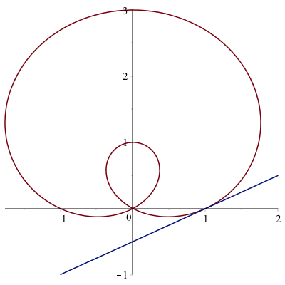

###Exercise
Find the tangent line to the cardiod $r=1+\cos(\theta)$ at the point $(0,1)$.  Plot both on the same axes.  


Multiple plot types and the `display` command
------

We have seen above that if we want to plot more that one curve on the same axes.

If we want to plot the parametric curve
$$x=2\sin 2t \quad y=2\sin t,$$
with the implicit curve given by
$$(x^{2}+y^{2})^{2}-2(x^{2}-y^{2}) = 1$$

then so far we would have to turn the parametric curve into an implicit one or the implicit one into a parametric curve.  Neither may be easy or possible.  Instead, here we will plot both and then put them together with the `display` command.  

###Plot of the first curve

Since the first curve is parametric, let's plot it like:
```
plot1:=plot([2*sin(2*t), 2*sin(t),t=0..2*Pi])
```
where we have given the plot a variable name.  The plot is

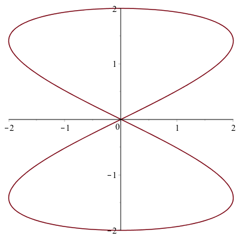

###Plot of the 2nd curve

And the second curve is implicit so
```
plot2:=implicitplot((x^2+y^2)^2-2(x^2-y^2)=1,x=-2..2,y=-2..2)
```

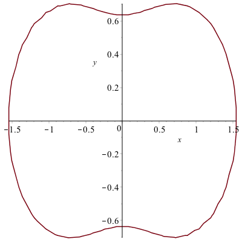

and as you can see, we'll adjust it with the `gridrefine` option by setting it to 1.  

To put these together, we'll use the `display` command and adjust some colors and add a legend for each.  

```
plot1 := plot([2*sin(2*t), 2*sin(t), t = 0 .. 2*Pi], legend = ["parametric curve"]):
plot2 := implicitplot((x^2+y^2)^2-2*(x^2-y^2) = 1, x = -2 .. 2, y = -2 .. 2, color = blue, legend = "implicit curve", gridrefine = 1):
display(plot1, plot2);
```
Notice that the two plot commands have a colon at the end now so the plots aren't actually shown.  Only the plot via the `display` command is shown.  The plot is

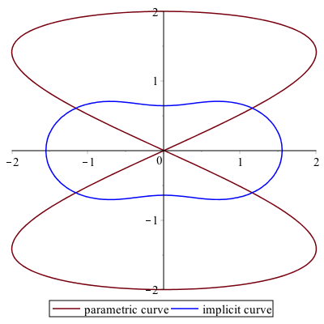


Common Options
------

* `view` which changes the viewing window.  Note: you should change the plotting domain as well with this.   
* `legend` which adds a legend.
* `color` which changes the color.


Scatter Plots
------

A scatter plot or a point plot is a plot of set of points given as $(x,y)$ coordinates.  We saw this in Chapter 2, but expand a bit more here.


Plot a set of discrete points as follows:

1. Enter the expression:`dots:=[[0,1],[1,0],[2,1],[3,0]]`
2. Enter the expression: `plot(dots,style=point)`

and you should see the following plot:


The points will be plotted as what is called a scatter plot. In order to connect the dots, add the style=line option to the end of the command.

We can also use the `pointplot` command in the plots package.
```
pointplot(dots)
```
which generates the same picture as above.   Let's generate the following plot using the `symbol` and `symbolsize` options.  


First, let's define the points as
```
pts:=[[1,1],[2,1],[1,2]]
```
and we can plot these with large filled in circles with
```
plot(pts, style = point, view = [0 .. 2, 0 .. 2], symbol = solidcircle, symbolsize = 15)
```
and similarly, we can create a line plot with the same points except that we need to repeat the first one to get a complete triangle
```
pts1 := [[1, 1], [2, 1], [1, 2]];
pts2 := [[1, 1], [2, 1], [1, 2], [1, 1]];
plot([pts1, pts2], style = [point, line], color = ["DarkRed", "DarkRed"], view = [0 .. 2, 0 .. 2], symbol = solidcircle, symbolsize = 15)
```
will reproduce the picture above.  You can also produce two separate plots and put them together.  

```
plot1 := pointplot(pts, symbol = solidcircle, symbolsize = 15):
plot2 := plot(pts2):
display(plot1, plot2, view = [0 .. 2, 0 .. 2])
```

will also produce the picture.  Note:  for this plot the `view` option needs to be on the display command not the plot command.  


animated plots
------

Animated plot are often helpful to visualize if you have a parameter in a plot and you want to view what's happening to it.  Consider the following: How does the parameter $a$ affect the graph of $y=(x-a)^{2}$.  Examine $a$ from $-3$ to $3$.

Note: a standard plot cannot handle with because there is both a variable $x$ and one called $a$.  If you just try to plot $(x-a)^{2}$, you will get an error.  However, an animated one will help with this.

If we enter:
```
animate(plot, [(x-a)^2, x = -5 .. 5], a = -3 .. 3)
```
and then hit the play button on the toolbar, you will see the parameter $a$ change as listed in the title of the plot. In general, there are three parts of the animate command (check out the Help Browser):

* the first parameter is the plotting command (this is just `plot`, but you can do other plots)
* the second parameter is a list that is passed to the command in the 1st parameter.  In this case this would be
    ```
    plot((x-a)^2,x=-5..5)
    ```

    and this is where any other options should be put as well.  (Look below for examples)
* The third parameter is the range on the animation parameter.  For what values is the animation made.  


It's a bit hard to see what happens though because of the plotting window, so let's add a view option to the animation:

```
animate(plot,[(x-a)^2,x=-5..5,view=[-5..5,-1..10]],a=-3..3)
```
and if you run this you can see that as $a$ increases the vertex shifts to the right.  


###A Parametric Example

Perhaps we want to see what happens to the parametric curve
$$
x=5\cos(t)\qquad y=b\sin t$$
for some $b$ values. We also use the animate with plot, but the 2nd parameter needs to be written in a different way:
```
animate(plot, [[5*cos(t), b*sin(t), t = 0 .. 2*Pi]], b = 1 .. 8)
```
where the 2nd parameter needs to be in 2 sets of square brackets because for a parametric plot the functions needs to be a list.

The animation shows that the parameter $b$ is the height of the ellipse and you should set the plotting to be 1:1 for an accurate view of this.  


###An polar plot example

We can also make a animation based on a polar plot.  Take for example,
```
animate(polarplot, [1-a*sin(theta), theta = 0 .. 2*Pi], a = -4 .. 4)
```


###Exercise

The set of points defined by
$$y^{2} (y^{2}-a^{2})=x^{2}(x^{2}-b^{2})$$
are called the Devil's curve.  Let $b=1$, and let $a$ range from 0.1 to 2.1 in an animated plot.


Three Dimensional Plots
------

Maple also handles some plots in three dimensions.  This is just a few examples.  Take a look at the Help Browser for more information on these.

Notice after plotting each of these, you can use your mouse to spin the plot around getting a better perspective.  

###Three-D Function plot

This is plot of the function $z=x^{2}+y^{2}$.

```
plot3d(x^2+y^2, x = -2 .. 2, y = -2 .. 2)
```

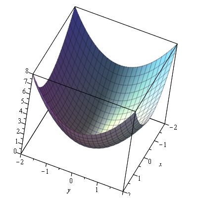

###Three-D parametric plot

This is a plot of a helix written parametrically:
$$x=\cos t \qquad y=\sin t \qquad z=t/10$$

```
spacecurve([cos(t), sin(t), t/10], t = 0 .. 4*Pi)
```

which results in

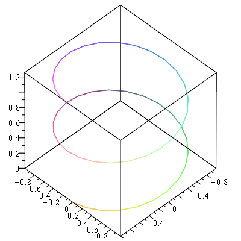

###Implicit plot in 3 variables

Here's a plot of the sphere
$$x^{2}+y^{2}+z^{2}=1$$

```
implicitplot3d(x^2+y^2+z^2 = 1, x = -1 .. 1, y = -1 .. 1, z = -1 .. 1)
```

which produces the plot:
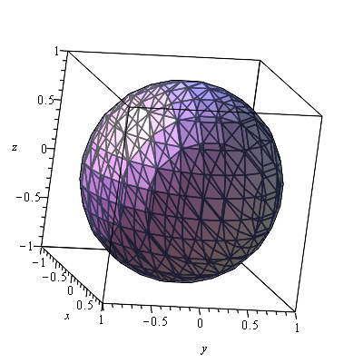


### Vector Field plots


A basic plot of the field $\textbf{F} = y \hat{i}-x \hat{j}$ is
```
fieldplot([y,-x], x=-10..10,y=-10..10)
```

gives the plot:

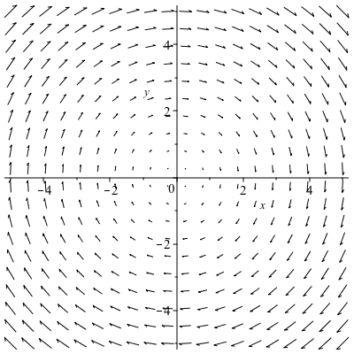

and if you want a direction field (in that the length of the vectors are all the same)
```
fieldplot([y,-x],x=-10..10,y=-10..10,fieldstrength=fixed)
```

and the result is
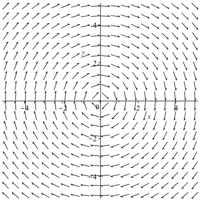

If we want a 3D plot of a vector field,

```
fieldplot3d([x, y, z], x = 0 .. 2, y = 0 .. 2, z = 0 .. 2)
```

produces

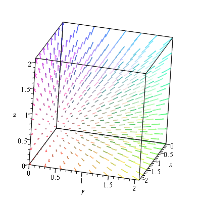
