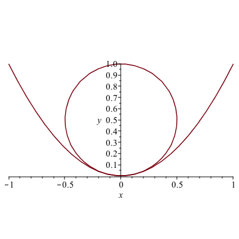

Chapter 13: Curvature of Plane curves
=======

[Return to all notes](index.html)

An interesting topic related to derivatives is that of the curvature of a curve at a point, called $\kappa$, the greek letter kappa, which is
$$
\kappa = \frac{|f^{\prime\prime}(a)|}{(1+f'(a)^{2})^{3/2}}
$$

Geometrically, the curvature is
$$ \kappa = \frac{1}{R}$$
where $R$ is the radius of the circle that is tangent to the curve at the point $(a,f(a))$

As an example, let's take $f(x)=x^{2}$ and find the curvature at $x=0$.  Plugging into Maple, we get: $\kappa = 2$.  Thus the radius of the circle that is tangent to this is $R=1/2$ and since $x=0$, then the circle is $x^{2}+(y-1/2)^{2} =(1/2)^{2}$.  A plot of this is

### Example

Find the tangent circle to the curve $y=x^{2}$ at $x=1$.  Plot the curve and the circle.  

### Exercise

Find the curvature of $y=\cos x$ at $x=0$.  Find the tangent circle and plot both the function and the circle.  

Repeat for $x=\pi/4$.  
