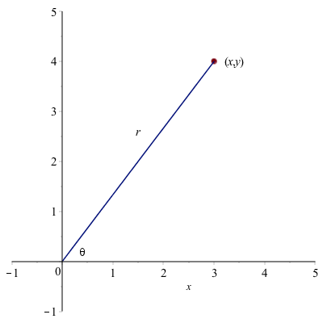

Complex Numbers
=======

Recall that the imaginary unit $i$ is defined as the number such that $i^2=-1$.  In Maple, this is a built-the constant $I$.   Just for kicks, try it:
```
I^2
```

and you get $-1$.  

The Complex Plane
-----

The complex plane is just like the $xy$-plane in which the horizontal axis is the real axis and the vertical one is the imaginary axis.  
We can plot any point $x_1+i y_1$ as the point $(x_1,y_1)$ on the standard $xy$-plane. 

(add a plot)

The real an imaginary parts of a complex number
-----

If $x$ and $y$ are real numbers and we define $z=x+iy$, then there are functions that return the real and imaginary parts of $z$.  Mathematically, we use $\Re(z)$ and $\Im(z)$ to represent these and they are defined as 

$$\Re(z)=x \qquad \Im(z)=y$$

and note that the imaginary part of a complex number is a real number. 

In Maple, we use the commands `Re` and `Im`.  If we define
```
z:=3+4I
```

Then `Re(z)` returns 3 and `Im(z)` returns 4.  


The Polar Form of a complex number
----

Another important form of a complex number is called the *polar form*.  If we find $r$, the distance from the origin to the point $(x,y)$ and $\theta$, the counterclockwise angle between the positive $x$ axis and the line segment as shown



The distance $r$ is defined as $r=\sqrt{x^2+y^2}$ and $\theta = \tan^{-1} (y/x)$ (and it might need to be shifted depending on the quadrant of the point.)  

In addition, the distance $r$ is often denoted as $|z|$, where the standard absolute value symbol is used.  

Maple uses the absolute value symbol for the distance and the `argument` command for the angle.  For example, if
```
z:=3+4*I
```

then `|z|` returns 5 and `argument(z)` returns $\arctan(4/3)$.   The argument of $2+2I$ is $\pi/4$.   


(complex exponential form)


Complex Conjugate
-----

If $z=x+iy$, then the complex conjugate of $z$, denoted $\overline{z}$ is $x-iy$.  In short, it switches the sign of the imaginary term.  

In Maple, the command `conjugate` will return the complex conjugate. 
```
conjugate(z)
```

returns $3-4i$.  

You can enter the conjugate by typing the first of `conjugate`, hitting ESC and selecting $\overline{x}$.  

Note that it is common that a complex number is mutiplied by its conjugate, so 
$$\begin{array}{rl} z \overline{z} & = (x+iy)(x-iy)  \\
& = x^2 +ixy-ixy-i^2y^2 = x^2+y^2\end{array}$$

which is $|z|^2$. 


(geometric/vector geometry of conjugate)


Arithmetic with complex numbers. 
-----

Maple can handle standard arithmetic operations with complex nubmers. Just to recall if
$$z_1=x_1+i y_1 \qquad z_2 = x_2 + i y_2$$

then 
$$\begin{array}{rl}
z_1 + z_2 & = (x_1+x_2) + i(y_1+y_2)\\
z_1 - z_2 & = (x_1-x_2) + i(y_1-y_2) \\
z_1 z_2 & = (x_1+iy_1)(x_2+iy_2) \\
& = (x_1x_2+iy_1x_2+ix_1y_2+i^2y_1y_2)\\
& = (x_1x_2-y_1y_2)+i(x_1y_2+x_2y_1)
\end{array}$$

Also, if we have $1/z_1$, then we can write this as
$$\begin{array}{rl}
\dfrac{1}{z_1} & = \dfrac{1}{x_1+iy_1} \end{array}$$
mulitply top and bottom by $\overline{z_1}$
$$\begin{array}{rl}
\dfrac{1}{z_1} = \dfrac{1}{z_1}\dfrac{\overline{z_1}}{\overline{z_1}} & = \dfrac{1}{x_1+iy_1} \dfrac{x_1-iy_1}{x_1-iy_1} \\
&= \dfrac{x_1-iy_1}{x_1^2+y_1^2}
\end{array}$$
and in a similar manner:
$$\begin{array}{rl}
\dfrac{z_1}{z_2} & = \dfrac{x_1+iy_1}{x_2+iy_2} \\
& = \dfrac{x_1+iy_1}{x_2+iy_2} \dfrac{x_2-iy_2}{x_2-iy_2} \\
& = \dfrac{x_1x_2+y_1y_2+i(y_1x_2-y_2x_1)}{x_2^2+y_2^2}
\end{array}$$


An integer power of a number is found by successive multiplications. For example, 
$$\begin{array}{rl}
z^2 & = (x+iy)(x+iy)=x^2-y^2+2xy i\end{array}$$

Maple can do all of these operations naturally.  For example, if 
```
z1:=3+4i
z2:=2-2i
```

Then `z1+z2` returns $5+2I$, `z1-x2` returns $1+6I$, `z1*z2` returns $14+2I$ and `z1/z2` returns 
$$-\frac{1}{4}+\frac{7}{4}I$$

`z1^2` returns $-7+24I$.  

Geometry of Arithmetic of Complex numbers
------


Mandlebrot Set
-------

This section explore a very interesting visual look at an iteration of complex numbers.   

We consider the iteration 

$$z_{n+1}=z_n^2 + C \qquad z_0 = 0$$
for some complex number $C$.  Let's examine a few examples.

If $C=i$, then using Maple, if we type
```
z:=n->z(n-1)^2+I
z(0):=0
```

and `seq(z(n),n=0..5)` returns $0, I, -1+I, -I, -1+I, -I$  and notice that the last two term will continue under repetition.  

If $C=1+I$, then  the first 6 terms is:
$$0, 1+I, 1+3I, -7+7I, 1-97I, -9407-193I$$
and then the terms get further from the the origin.  

We say that the sequence when $C=I$ is bounded and when $C=1+I$, the sequence is unbounded.   The set $M=\{C \; | \; \lim_{n \rightarrow \infty} z_n \mbox{~is bounded}\}$ is called the *Mandelbrot Set* and is the set of all values of $C$ such that the iteration of the iteration is bounded.  For example $I$ is in $M$, but $1+I$ is not.  

There is a theorem (that we won't prove) that states:  *If $|z_n|>2$, then $|z_{n+1}| \rightarrow \infty$ if $z_{n+1} = z_n^2+C$ for any value of $C$.*

Basically, this means that if there is a complex number $z_n$ such that $|z_n|>2$, then the sequence will diverge and it is not in the mandelbrot set.  

It's helpful to have a procedure that determines the number of steps such that $|z_n|>2$.

```
mandelSteps := proc (c::complex)::posint; 
  local z:=0.0+0.0*I, i:=0; 
  while |z| < 2 do 
    i := i+1; 
    z := z^2+c; 
    if 25 < i then break end if 
  end do; 
  return i 
end proc:
```

This function is the main way of understanding the mandelbrot set.  Let's test it:
```
mandelSteps(0+0*I)
```

return 26, which basically means the origin is in the mandelbrot set, however,
```
mandelSetps(1+I)
```
returns 3, which means it took 3 steps to leave $|z|>2$.  


Visualizing the Mandelbrot Set
----


